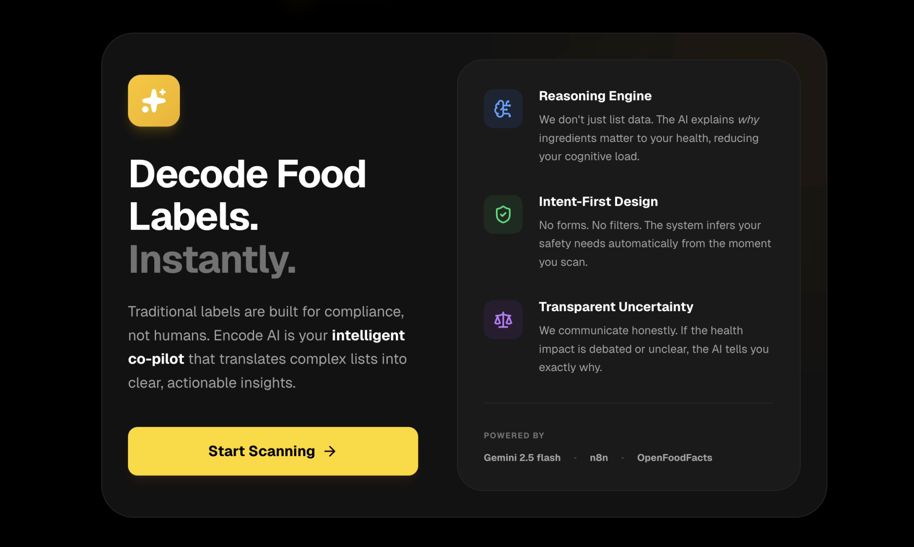

# Encode AI ⚡️

**Your Intelligent Health Co-pilot.** 
Decoding food labels into clear, actionable insights.

 
 

## 🏆 Problem Statement
**The Consumer Health Information Gap.** 

Traditional food labels are optimized for regulatory compliance, not human understanding. Consumers are forced to decode complex chemical names, calculate serving sizes, and navigate conflicting health advice at the exact moment they need to make a decision. This creates high **cognitive load** and uncertainty.

## 🚀 The Solution

**Encode AI** is an AI-Native experience that acts as a nutritional firewall between you and the shelf. It shifts the paradigm from "Data Retrieval" to **"Reasoning & Explanation."**

### Key Features

* **🛡️ Intent-First Design:** No forms, profiles, or filters. The system infers safety vs. nutrition intent instantly upon scanning.

* **🧠 Reasoning Engine:** Instead of just listing "Sugar: 40g", the AI explains *why* it matters (e.g., "High likelihood of insulin spikes").

* **🎨 Generative UI:** The interface adapts its color, iconography, and layout based on the risk level (Red for Danger, Green for Safe) to reduce cognitive effort.

* **📸 Visual History:** Automatically tracks your scan journey with product imagery for quick comparison.

## 🛠️ Tech Stack

* **Frontend:** Next.js 14 (App Router), Tailwind CSS, Framer Motion (for "Generative" feel).
* **Icons:** Lucide React.
* **Backend / AI Orchestration:** n8n (Workflow Automation).
* **Intelligence:** Google Gemini 1.5 Pro (via n8n).
* **Data Source:** OpenFoodFacts API.

## ⚙️ How It Works (Architecture)

1.  **Input:** User scans a barcode (or uploads an image).
2.  **Processing:** The app sends the data to our **n8n** webhook.
3.  **Data Fetch:** n8n queries the **OpenFoodFacts API** for raw ingredients.
4.  **Reasoning:** **Google Gemini 1.5 Pro** analyzes the ingredients against health    parameters to generate a JSON "Risk Profile."
5.  **Generative Output:** The Frontend receives the JSON and dynamically renders the appropriate UI card (Alert, Info, or Success).

## 💻 Getting Started

### Prerequisites
* Node.js 18+
* npm or yarn

### Installation
1.  Clone the repository:
    ```bash
    git clone [https://github.com/yourusername/encode-health-app.git](https://github.com/yourusername/encode-health-app.git)
    ```
2.  Install dependencies:
    ```bash
    cd encode-health-app
    npm install
    ```
3.  Run the development server:
    ```bash
    npm run dev
    ```
4.  Open [http://localhost:3000](http://localhost:3000) in your browser.

## 🎥 Demo Mode

For judging purposes, this prototype includes a **"Demo Sequence"** mode.
Clicking **"Scan"** cycles through 5 distinct scenarios (High Risk, Healthy, Complex, Allergen, Safe) to demonstrate the Generative UI capabilities without needing physical products at hand.

---
**Submitted for the Encode Hackathon 2026.**